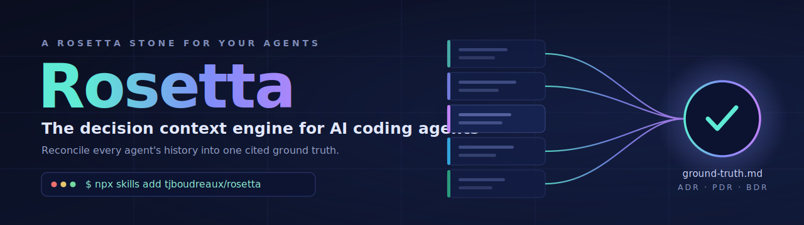

<!-- SEO: Rosetta — Claude Code / agent skill that reconciles AI coding agent conversation history (Claude Code, Codex, Gemini CLI, Cursor, Aider, opencode, Cline, and more) into a cited ground truth and generates ADR / PDR / BDR decision records. Local, deterministic, pure-stdlib Python. -->

<p align="center">
  
</p>

<p align="center">
  <a href="LICENSE"></a>
  <a href="https://skills.sh"></a>
  <a href="skills/rosetta/docs/agents.md"></a>
  
  <a href="https://github.com/tjboudreaux/rosetta/actions/workflows/ci.yml"></a>
  <a href="skills/rosetta/CONTRIBUTING.md"></a>
</p>

# Rosetta — the decision context engine for AI coding agents

**Your AI coding agents make hundreds of decisions across dozens of sessions — then that context
evaporates the moment each window closes.**

Rosetta is an open-source [agent skill](https://agentskills.io) that reads every coding agent's local
conversation history (across **18 tools**), reconciles it with your git history and docs, and turns it
into one *cited* **ground truth** — plus durable **decision records** (ADRs, PDRs, BDRs). So you, your
team, and the next agent never lose the thread. **The core collector and decision CLI are 100% local,
read-only, pure-stdlib Python, zero dependencies.** (Optional external-source ingestion via MCP is
agent-driven and opt-in — see ADR 0012.)

> Like the Rosetta Stone recovered one meaning across three scripts, Rosetta recovers one project
> truth across many incompatible agent transcript formats.

```bash
npx skills add tjboudreaux/rosetta        # skills.sh — Claude Code, Codex, Gemini, Cursor, opencode…
gh skill install tjboudreaux/rosetta      # or via GitHub CLI
```

Then just ask your agent: **“build a ground truth for this project from all our previous agent
conversations.”**

---

## Table of contents

- [What is Rosetta?](#what-is-rosetta)
- [Who it's for](#who-its-for)
- [Why it exists](#why-it-exists)
- [How Rosetta compares](#how-rosetta-compares)
- [How it works](#how-it-works)
- [Quickstart](#quickstart)
- [Which agents does Rosetta support?](#which-agents-does-rosetta-support)
- [Decision records: ADR / PDR / BDR](#decision-records-adr--pdr--bdr)
- [CLI](#cli)
- [Use it for your team](#use-it-for-your-team)
- [FAQ](#faq)
- [Documentation](#documentation)
- [Roadmap](#roadmap)
- [Contributing & license](#contributing--license)

## What is Rosetta?

Rosetta answers two questions that scatter across dozens of agent sessions, repos, and chats:
**“what is true about this project right now?”** and **“what did we decide, and why?”**

It does this by reading the local transcript stores that AI coding agents leave behind — Claude Code,
Codex, Gemini CLI, Cursor, Aider, opencode, Cline, Goose, and more — reconciling them with the code
and git history, and producing two durable artifacts:

1. **`.agents/ground-truth.md`** — a reconciled, cited snapshot of the project's current state
   (coverage map, architecture, decisions, contradictions, provenance).
2. **A decision library** (`decisions/`) — individually-addressable **ADR** (architecture), **PDR**
   (product), and **BDR** (business) records with provenance and a status lifecycle.

## Who it's for

- **Solo developers** running several AI agents across many projects — stop re-explaining each project from scratch to every new session.
- **Teams** who need onboarding context and a decision audit trail a new hire (or a new agent) can actually read.
- **Anyone returning to a project weeks later** asking *"wait — why did we build it this way?"*

## Why it exists

The same project's history is smeared across five-plus incompatible storage schemes, most not
project-scoped the same way, several drifting across CLI versions. Reading it by hand is impossible;
reading it all into one context window is ruinous. And the two ways a summary fails are:

- **A silent gap** — it quietly missed an entire agent's history and still called itself ground truth.
- **Chat-as-fact** — it reported something the transcripts merely *discussed then abandoned* as done.

Rosetta is engineered to defeat both: **coverage is loud** (every run shows what it found *and missed*
before summarizing) and **code wins over chat** (a strict truth hierarchy where git arbitrates what
actually shipped).

## How Rosetta compares

How a project's history and decisions get reconstructed today — versus with Rosetta:

| | Reading transcripts by hand | A wiki / hand-written ADRs | **Rosetta** |
|---|---|---|---|
| Reads all 18 agents' formats | Manual, one tool at a time | — | **Automatic** |
| Reconciles against git (code wins) | No | No | **Yes — truth hierarchy** |
| Surfaces coverage gaps | No — silent misses | — | **Yes — loud manifest** |
| Every claim cited to its source | Rarely | Drifts from reality | **Yes — provenance** |
| Decisions as durable records | No | Manual upkeep | **ADR / PDR / BDR, auto-numbered** |
| Effort | Hours, every time | Ongoing discipline | **One command** |

Rosetta isn't another note-taking habit to maintain — it reconstructs the truth from history you've
already created.

## How it works

```
 agent transcripts          deterministic            agent synthesis           durable output
 (18 stores)        ──▶     collector (stdlib) ──▶   (reads normalized   ──▶   ground-truth.md
 Claude · Codex ·          normalizes + a            text, never raw;          + ADR / PDR / BDR
 Gemini · Cursor ·         loud coverage map         reconciles vs git;        decision records
 Aider · opencode …        (manifest.json)           adversarial verify)
```

- **Deterministic tools do the heavy lifting.** Path resolution, schema-tolerant parsing, timestamp
  normalization, decision numbering/indexing/validation — all pure Python, so the agent spends tokens
  only on judgment.
- **Never reads raw transcripts into context.** The collector writes clean per-session markdown;
  sub-readers digest that, keeping the heavy text out of the main context window.
- **Truth hierarchy:** `current code / git > committed decisions > docs > latest conversation > older
  conversation`. A transcript claim the code doesn't show is recorded as *intended*, not *done*.

## Quickstart

```bash
# 1. Install (pure stdlib — no pip, no deps)
npx skills add tjboudreaux/rosetta
alias rosetta="python3 ~/.claude/skills/rosetta/scripts/rosetta"

# 2. Discover which projects on your machine even have agent history
rosetta discover --out /tmp/disc && cat /tmp/disc/projects-index.md

# 3. Reconcile one project (or just ask your agent to "build a ground truth")
rosetta collect --project ~/code/your-project --out ~/code/your-project/.agents/rosetta/full

# 4. Capture decisions deterministically
rosetta decisions new --type adr --title "Adopt SQLite for the cache" --decider you
rosetta decisions index --root decisions && rosetta decisions validate --root decisions
```

Full flow with sample output: **[end-to-end walkthrough](skills/rosetta/docs/examples/end-to-end.md)**.

## Which agents does Rosetta support?

**18 agent transcript stores**, each with a purpose-built resolver + parser:

Claude Code · Claude Agent-Mode (Desktop) · Codex (OpenAI) · Factory / Droid · Cursor · Gemini CLI ·
opencode · Cline · Continue · Aider · Hermes · Qwen Code · Roo Code · Kilo Code · Goose (Block) ·
Crush (Charm) · Windsurf / Cascade · Augment.

Formats range from JSONL to one-JSON-per-message directories, nested JSON trees, markdown, and sqlite.
Unrecognized stores are **flagged loudly** rather than silently skipped, so you always know what wasn't
read. See the full table, scoping rules, and how to add an agent in **[docs/agents.md](skills/rosetta/docs/agents.md)**.

## Decision records: ADR / PDR / BDR

Rosetta turns scattered decisions into durable, cited records:

| Type | Captures |
|---|---|
| **ADR** — Architecture Decision Record | *how* the system is built (technical/structural) |
| **PDR** — Product Decision Record | *what* you make and why (product/strategy) |
| **BDR** — Business Decision Record | business/commercial calls, often made in meetings |

Each record carries `Sources:` provenance (`agent · session-id · date`, a commit, a code path), a
`Proposed → Accepted → Superseded (or Deprecated / Rejected)` lifecycle, and never silently oscillates. Rosetta's own
[`decisions/`](skills/rosetta/decisions) library is the reference implementation. Details:
**[docs/decisions.md](skills/rosetta/docs/decisions.md)**.

## CLI

```bash
rosetta collect   --project <path> --out <dir>   # gather + normalize a project's transcripts
                                                 #   (skips already-processed sessions; --reprocess rebuilds all)
rosetta discover  [--out <dir>]                  # machine-wide index of projects with history
rosetta decisions new|index|validate|integrity|staleness|search|get|supersede|resolve|coverage
rosetta ingest    --root ./decisions --from x.json   # external decisions (meetings/Slack) -> Proposed records
```

`validate` exits nonzero on a malformed library, so it drops straight into CI. No install needed, but
`pip install -e skills/rosetta` puts `rosetta` on your PATH. Full reference:
**[docs/cli.md](skills/rosetta/docs/cli.md)**.

## Use it for your team

The decision-record format **bends to your team**, not the reverse. Drop a `config.json` at your
`decisions/` root to define your own record types, directories, numbering, statuses, required fields,
and templates — or omit it for sensible defaults. Add a new record type (say, a Governance record)
with no code change. See [docs/decisions.md → customize](skills/rosetta/docs/decisions.md#use-your-own-templates-any-team).

## FAQ
**Is my data sent anywhere?** No. The core collector and decision CLI are fully local and read-only
against your own machine's transcript files — pure-stdlib Python, no network calls, no telemetry, no
dependencies. (Optional MCP external-source ingestion is agent-driven, opt-in, and uses your
authenticated agent session — see ADR 0012.) The normalized-transcript cache (`.agents/`) can contain
secrets, so it's git-ignored by default.

**Is it only for Claude Code?** No. It installs into any [skills-compatible agent](https://agentskills.io)
(Claude Code, Codex, Gemini CLI, Cursor, opencode, and more) and *reads* 18 different agents' histories.

**How is this different from just grepping my transcripts?** Rosetta resolves each agent's storage
scheme, filters to the right project, tolerates schema drift, reconciles conflicting sources against
git, and adversarially verifies claims — then makes coverage gaps explicit. Grep does none of that.

**What does “ground truth” mean here?** A single document that states what's actually true about a
project *now* (verified against code/git), with every claim cited to its source and contradictions
called out rather than smoothed over.

**What are ADRs, PDRs, and BDRs?** Lightweight markdown decision records — architecture, product, and
business — each with rationale, provenance, and a status. They turn “why did we do this?” archaeology
into a queryable, version-controlled library.

**Do I need to write the records by hand?** No — the agent drafts them from the reconciled history;
the deterministic `decisions.py` handles numbering, the index, and validation.

## Documentation

- [Getting started](skills/rosetta/docs/getting-started.md)
- [Agents & discovery](skills/rosetta/docs/agents.md)
- [Decision records](skills/rosetta/docs/decisions.md)
- [CLI reference](skills/rosetta/docs/cli.md)
- [End-to-end walkthrough](skills/rosetta/docs/examples/end-to-end.md) · [Example ground truth](skills/rosetta/docs/examples/ground-truth.example.md)
- [Agent store registry](skills/rosetta/references/agent-stores.md) · [Decision schema](skills/rosetta/references/decision-schema.md)

## Roadmap

- **External-source ingestion** (Circleback meeting notes, Slack) so human/meeting decisions become
  cited records too — the deterministic scaffolder (`scripts/ingest.py`) shipped; live MCP connectors
  are agent-driven and auth-dependent. Accepted, [ADR 0012](skills/rosetta/decisions/architecture-decisions/0012-mcp-external-source-ingestion.md).
  Design: [references/external-sources.md](skills/rosetta/references/external-sources.md).
- **Installable CLI packaging** — `pip install -e skills/rosetta` puts `rosetta` on PATH (shipped);
  portable wheel / PyPI publish deferred. Accepted, [ADR 0013](skills/rosetta/decisions/architecture-decisions/0013-installable-cli-packaging.md).
- Resolvers for more agents as they appear (the sweep flags unknown stores so you know when to add one).

## Contributing & license

Contributions welcome — adding an agent is usually a registry row + a resolver + a fixture. See
[CONTRIBUTING.md](skills/rosetta/CONTRIBUTING.md). Licensed under [MIT](LICENSE).

---

### Try it now

```bash
npx skills add tjboudreaux/rosetta
```

Then ask your agent to **“build a ground truth for this project.”** If it saves you an afternoon of
decision archaeology, a ⭐ helps other developers find it.

<sub>Rosetta is a local-first Claude Code / agent skill for reconciling AI coding agent conversation
history — across Codex, Gemini CLI, Cursor, Aider, opencode, Cline, Goose and 11 more — into one cited
ground truth, and for generating ADR, PDR, and BDR decision records. Latest release: v0.1.1 · MIT licensed.</sub>
